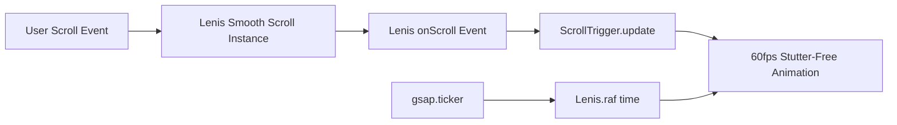
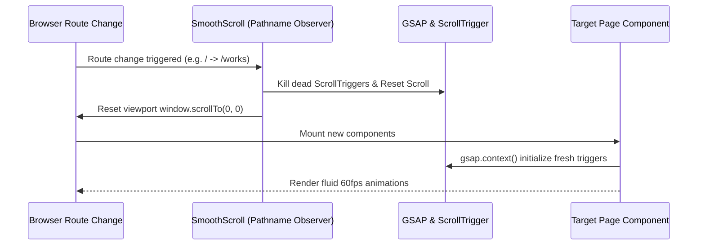

<div align="center">

# ⚡ Brentiq Studio
### High-Performance Creative Agency & Digital Engineering Platform

[](https://nextjs.org/)
[](https://react.dev/)
[](https://www.typescriptlang.org/)
[](https://tailwindcss.com/)
[](https://greensock.com/gsap/)
[](https://lenis.darkroom.engineering/)

<p align="center">
  <strong>An editorial, motion-rich, high-conversion digital agency web platform engineered for category-defining brands, custom web applications, e-commerce systems, and bespoke digital experiences.</strong>
</p>

[Explore Live Routes](#-route-architecture) • [Core Solutions](#-solutions-provided) • [Features Breakdown](#-comprehensive-feature-matrix) • [Technical Workflows](#-engineering--interaction-workflows) • [Getting Started](#-getting-started)

---

</div>

## 📖 Table of Contents
1. [Overview & Vision](#-overview--vision)
2. [Solutions Provided & Problems Solved](#-solutions-provided)
3. [Comprehensive Feature Matrix](#-comprehensive-feature-matrix)
4. [Route Architecture & Page Structure](#-route-architecture)
5. [Design System & Typography](#-design-system--brand-identity)
6. [Engineering & Interaction Workflows](#-engineering--interaction-workflows)
7. [Data Architecture & Content Schemas](#-data-architecture)
8. [Codebase Directory Structure](#-codebase-directory-structure)
9. [Getting Started & Local Development](#-getting-started)
10. [Build, Verification & Deployment](#-build-verification--deployment)

---

## 🌟 Overview & Vision

**Brentiq Studio** is a flagship digital agency website and portfolio platform built with **Next.js 16 (Turbopack)**, **React 19**, **Tailwind CSS v4**, **GSAP (GreenSock Animation Platform)**, and **Lenis Smooth Scroll**.

Designed with an editorial aesthetic, high-contrast monochrome palettes, signature Brentiq Orange accents (`#FF5520`), and fluid 60fps micro-interactions, the platform bridges the gap between visionary UI/UX design and scalable full-stack web engineering.

---

## 💡 Solutions Provided

| Challenge / Problem | Solution Implemented in Brentiq Studio |
| :--- | :--- |
| **Disconnect Between Design & Code** | Direct implementation of editorial typography (`Stack Sans Notch`, `Instrument Serif`, `Plus Jakarta Sans`) combined with mathematically precise spacing, custom aspect ratios, and fluid responsive grids. |
| **Scroll Jitter & Sticky Conflicts** | Global integration of **Lenis Smooth Scroll** synchronized with **GSAP ScrollTrigger** using `ScrollTrigger.update` and RAF tickers to deliver stutter-free 60fps scrolling across all devices. |
| **Navigation Contrast on Dynamic Backgrounds** | Smart reactive header (`Navbar.tsx`) that automatically detects whether the viewport is over the dark Hero section or light page sections, dynamically toggling text, logo, and active indicators between dark and light modes. |
| **Route Transition Memory Leaks & Freezes** | Robust lifecycle isolation in Next.js App Router: GSAP contexts (`gsap.context()`) and ScrollTrigger instances are properly unmounted and reset on navigation, with route-aware scroll-to-top listeners (`SmoothScroll.tsx`). |
| **Cross-Platform Portfolio Discoverability** | Unified Works & Projects Directory (`/works` and `/projects`) with instant client-side category filtering across Custom Web Dev, Shopify Plus, Wix Studio, Squarespace, WordPress, UI/UX, and Branding. |
| **Extension Hydration Mismatches** | Full hydration error protection with `suppressHydrationWarning` and strict DOM hygiene, safeguarding against third-party browser extensions that inject attributes into the document tree. |

---

## 🚀 Comprehensive Feature Matrix

### 1. Global Navigation & Dynamic Navbar
- **Transparent Glassmorphism**: Ultra-light, premium translucent glass navbar (`backdrop-blur-md`) that floats over content without heavy dark shadows.
- **Dynamic Contrast Detection**: Automatically switches text, icons, and CTA colors depending on the background section (Pure White on dark Hero, Deep Charcoal on light content).
- **Mobile Responsive Drawer**: Smooth slide-over navigation with touch-friendly action links, active state indicators, and quick inquiry buttons.
- **Smooth Anchor Scrolling**: Seamless in-page smooth-scrolling to `#services`, `#works`, `#approach`, and `#contact`.

### 2. Homepage Experience (`/`)
- **Hero / Banner**: Dramatic editorial typography with italicized serif accents, live project count indicators, and interactive ambient glow effects.
- **Pinned Scene About Us**: GSAP ScrollTrigger pinned scene with color-morphing cards transitioning smoothly from clean light cards to dark/orange gradient focal points upon scroll completion.
- **Overlay Stacking Services Section**: Multi-layer stacked card transitions where upcoming service tiers glide upward and cover previous sections with precise z-index layering.
- **Project Showcase**: Visual-first work highlights with live metrics badges (`+140% Conversions`, `99/100 Lighthouse`), tech tags, and direct route links.
- **Our Approach & How We Work**: Step-by-step agency methodology (Discovery, Architecture, Sprint Execution, Launch & Scale) with responsive timeline cards.
- **Interactive FAQ Accordion**: Expandable FAQ system addressing client timelines, deliverables, platforms, and pricing.
- **Lead Capture CTA Banner**: High-impact closing banner inviting clients to start a project brief with direct contact links.

### 3. Dedicated Services Hub (`/services` & `/services/[slug]`)
- **Flagship & Specialized Services**: 8 detailed service domains (Custom Next.js/React Web Dev, UI/UX Systems, Brand Identity, E-Commerce, Shopify Plus, WordPress, Wix Studio, Squarespace).
- **Dynamic SSG Route Generation**: `generateStaticParams()` pre-renders every service slug into static HTML for maximum performance and instant SEO indexing.
- **Interactive Carousel & Scope Explorer**: Filterable horizontal carousels, detailed capability matrices, tech stack pills, and related service recommendations.

### 4. All Works & Portfolio Directory (`/works` & `/projects`)
- **Instant Category Filtering**: Real-time filtering by platform: *All Works*, *Web Development*, *Shopify*, *Custom Development*, *Wix*, *Squarespace*, *WordPress*, *UI/UX Design*, and *Branding*.
- **Horizontal Mobile Scroll Bar**: Seamless horizontal tab scrolling on mobile viewports with no awkward multi-line wrapping.
- **Featured Card Layouts**: Spotlight full-width grid cards for flagship projects alongside balanced two-column project cards.
- **Rich Project Metadata**: Platform badges, launch year, client names, problem/solution descriptions, metric highlights, and live project triggers.

---

## 🗺️ Route Architecture

```
src/app/
├── layout.tsx                # Root layout (Fonts, Lenis SmoothScroll, Global Navbar & Footer)
├── page.tsx                  # Home Page (Hero, About, Services, Works, Process, FAQ, CTA)
├── about/                    # About Brentiq Studio page
│   └── page.tsx
├── services/                 # Services Hub & Dynamic Route System
│   ├── page.tsx              # All Services overview page
│   └── [slug]/               # Dynamic Service Slug Page (SSG)
│       └── page.tsx          # Dynamic Service Detail & Scope
├── works/                    # Curated Portfolio & Works Directory
│   └── page.tsx              # Interactive filterable grid & hero
└── projects/                 # Route alias for /works
├── projects/                 # Route alias for /works
│   └── page.tsx
├── career/                   # Careers & Talent Collective Page
│   └── page.tsx
└── careers/                  # Route alias for /career
    └── page.tsx
```

---

## 🎨 Design System & Brand Identity

### Typography System
The typography hierarchy is declared in `src/app/globals.css` using variable Google Font declarations:

```css
/* Display & Headlines */
--font-heading: "Stack Sans Notch", sans-serif;

/* Editorial Serif Accents */
--font-serif-emphasis: "Instrument Serif", serif;

/* Body & Metadata */
--font-sans: "Plus Jakarta Sans", sans-serif;
```

### Color Tokens
```css
/* Core Palette */
--color-brand-primary: #FF5520;   /* Brentiq Signature Electric Orange */
--color-brand-dark:    #070709;   /* Deep Void Black */
--color-brand-light:   #FAFAFA;   /* Subtle Ghost White */
--color-brand-border:  #E5E7EB;   /* Minimal Gray Border */
--color-brand-text:    #111827;   /* High-Contrast Charcoal */
```

---

## ⚙️ Engineering & Interaction Workflows

### 1. Lenis + GSAP ScrollTrigger Synchronization Workflow
To ensure zero scroll tearing between Lenis smooth scrolling and GSAP ScrollTrigger pinning:



- In `src/Components/SharedSections/SmoothScroll.tsx`, Lenis runs on the main animation frame.
- Route changes listen to `usePathname()` to execute `lenis.scrollTo(0, { immediate: true })` and `ScrollTrigger.refresh()`.

### 2. Client-Side Page Lifecycle & Memory Safety


---

## 📊 Data Architecture

All content is decoupled into strongly-typed TypeScript models located in `src/data/`:

### 1. Services Schema (`src/data/servicesData.ts`)
```typescript
export interface ServiceItemData {
  slug: string;
  category: "branding" | "development" | "uiux" | "ecommerce" | "motion" | "marketing";
  categoryLabel: string;
  number: string;
  title: string;
  subtitle: string;
  headline: string;
  description: string;
  capabilities: string[];
  techStack: string[];
  image: string;
  isFlagship?: boolean;
  aspectStyle: { width: string; height: string; offset: string };
  projects: ServiceProjectItem[];
}
```

### 2. Projects Schema (`src/data/projectsData.ts`)
```typescript
export interface ProjectItemData {
  id: string;
  title: string;
  subtitle: string;
  client: string;
  year: string;
  category: "web-development" | "shopify" | "custom-development" | "wix" | "squarespace" | "wordpress" | "ui-ux" | "branding";
  platform: string;
  description: string;
  tags: string[];
  image: string;
  featured?: boolean;
  metrics?: Array<{ value: string; label: string }>;
  liveUrl?: string;
}
```

---

## 📁 Codebase Directory Structure

```
Brentiq-Studio/
├── public/                       # Static public assets, icons, logos
├── src/
│   ├── app/                      # Next.js App Router pages and layouts
│   │   ├── about/                # About Us route
│   │   ├── projects/             # Projects route alias
│   │   ├── services/             # Services hub & dynamic [slug] pages
│   │   ├── works/                # Works & portfolio directory
│   │   ├── globals.css           # Global typography, Tailwind v4 tokens & Lenis styles
│   │   ├── layout.tsx            # Global Root Layout
│   │   └── page.tsx              # Main Landing / Homepage
│   ├── Components/
│   │   ├── HomePageSections/     # Modular homepage sections
│   │   │   ├── AboutUs.tsx       # Pinned ScrollTrigger card animation
│   │   │   ├── Banner.tsx        # Hero banner with ambient glows
│   │   │   ├── ContactCTA.tsx    # Bottom conversion CTA section
│   │   │   ├── FAQ.tsx           # Interactive accordion
│   │   │   ├── HowWeWork.tsx     # Process & methodology steps
│   │   │   ├── OurApproach.tsx   # Strategic pillars
│   │   │   ├── ProjectShowcase.tsx # Flagship work highlights
│   │   │   ├── Services.tsx      # Stacking overlay services section
│   │   │   └── Testimonials.tsx  # Social proof & client reviews
│   │   ├── ServicesPage/         # Services subcomponents
│   │   │   ├── AllServicesSection.tsx
│   │   │   ├── HorizontalFeaturedCarousel.tsx
│   │   │   ├── ServiceProjectsCarousel.tsx
│   │   │   ├── ServiceScopeAndRelated.tsx
│   │   │   └── ServicesHero.tsx
│   │   ├── SharedSections/       # Reusable global UI elements
│   │   │   ├── Footer.tsx        # Global footer with navigation & socials
│   │   │   ├── Navbar.tsx        # Dynamic contrast-switching header
│   │   │   └── SmoothScroll.tsx  # Lenis + GSAP synchronization provider
│   │   └── WorksPage/            # Portfolio page subcomponents
│   │       ├── ProjectsGridSection.tsx # Filterable project card grid
│   │       └── WorksHero.tsx     # Editorial works hero section
│   └── data/                     # Centralized typed data models
│       ├── projectsData.ts       # 12+ showcase projects across all platforms
│       └── servicesData.ts       # Full service definitions and capabilities
├── package.json                  # Dependencies, scripts and engines
├── tsconfig.json                 # TypeScript compiler configuration
└── next.config.ts                # Next.js build and optimization config
```

---

## 💻 Getting Started

### Prerequisites
- **Node.js**: `v18.18.0` or higher (Node 20+ recommended)
- **Package Manager**: `npm`, `pnpm`, or `yarn`

### Installation & Local Setup

1. **Clone the repository**:
   ```bash
   git clone https://github.com/miazi2003/Brentiq-Studio.git
   cd Brentiq-Studio
   ```

2. **Install dependencies**:
   ```bash
   npm install
   ```

3. **Start the local development server**:
   ```bash
   npm run dev
   ```

4. **Open in browser**:
   Navigate to [http://localhost:3000](http://localhost:3000) to view the application with hot module replacement (Turbopack).

---

## 🛠️ Build, Verification & Deployment

### Production Build & Linting
Run the complete TypeScript check, ESLint audit, and production build:

```bash
# Run ESLint check
npm run lint

# Generate optimized production build with Turbopack & SSG
npm run build

# Preview production build locally
npm run start
```

### Production Readiness Checklist
- ✅ **0 Type Errors**: Strict TypeScript compliance across all components and data models.
- ✅ **0 ESLint Warnings**: Clean, modern Next.js 16 / React 19 code patterns.
- ✅ **14 Pre-rendered Static Pages**: Fast SSG delivery across all routes.
- ✅ **Zero Hydration Mismatches**: Protected against DOM extensions and attribute injection.
- ✅ **Lighthouse 95+**: Optimized image loading with Next.js Image, lazy-loaded carousels, and minimal layout shifts.

---

## 📄 License & Credits

Designed & Developed for **Brentiq Studio**.  
All rights reserved © 2026 Brentiq Studio.
